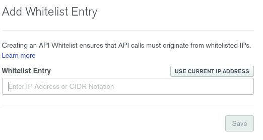

# mongodb-terraform-example

Quando analisamos os [providers](https://www.terraform.io/docs/providers/index.html) disponíveis do [Terraform](www.terraform.io), podemos ver vários além dos clássicos (AWS, GCP e Microsoft Azure).

Um **provider** é responsável por traduzir a implementação realizada em [HCL](https://www.terraform.io/docs/configuration/syntax.html)(notação que a engine do terraform implementa) e a API do objeto de destino seja ela um Cloud Provider ou outro item de infraestrutura.

E nesta definição nós temos o provider da [MongoDB Atlas](https://www.terraform.io/docs/providers/mongodbatlas/index.html), que provê uma interface com o Atlas para gerenciar os itens de infraestrutura por ele fornecido via api.

Dentre os itens oferecidos na atual versão 0.6.0, nós podemos gerenciar:

* [Database Users](https://www.terraform.io/docs/providers/mongodbatlas/r/database_user.html)
* [Projects](https://www.terraform.io/docs/providers/mongodbatlas/r/project.html)
* [Clusters](https://www.terraform.io/docs/providers/mongodbatlas/r/cluster.html)
* [Network Peering](https://www.terraform.io/docs/providers/mongodbatlas/r/network_peering.html)
* [Custom Roles](https://www.terraform.io/docs/providers/mongodbatlas/r/custom_db_role.html)
* [Alert Configuration](https://www.terraform.io/docs/providers/mongodbatlas/r/alert_configuration.html)
* [Backup Policy in Cloud Provider](https://www.terraform.io/docs/providers/mongodbatlas/r/cloud_provider_snapshot_backup_policy.html)

Observação 1: O [terraform-provider-mongodbatlas](https://github.com/terraform-providers/terraform-provider-mongodbatlas) ainda não tem integração com o MongoDB Realm e o MongoDB Charts.

Observação 2: Não é possivel gerencia clusters free tier (M0) por API, consequentemente não é possivel gerencia-lo pelo provider.

## Pré-requisitos

    * Uma conta no Atlas [https://cloud.mongodb.com/](https://cloud.mongodb.com/)
    * Org ID criado do Atlas
    * Payment Method
    * Utilitário do Terraform

Obs 1: A informação do Cloud ID você obtém na url da console (https://cloud.mongodb.com/v2#/org/<Org ID>/access/apiKeys)

Obs 2: Caso queria criar um cluster com terraform ("M2" ou superior), mesmo com os créditos promocionais, é necessário ter um método de pagamento adicionado no Atlas.

Caso não tenha o método adicionado, você receberá um erro semelhante a esse:

    ```sh
    mongodbatlas_cluster.cluster-example: Creating...

    Error: error creating MongoDB Cluster: POST https://cloud.mongodb.com/api/atlas/v1.0/groups/5rryh5iifj6yyrhh58884/clusters: 402 (request "Payment Required") No payment information was found for group 5rryh5iifj6yyrhh58884.

    on main.tf line 11, in resource "mongodbatlas_cluster" "cluster-example":
    11: resource "mongodbatlas_cluster" "cluster-example" {
    ```

## Demonstração

A implementação deste artigo encontra-se no repositório do github [afonsoaugusto/mongodb-terraform-example](https://github.com/afonsoaugusto/mongodb-terraform-example)

Após criar a sua conta no Atlas, para executar este tutorial você pode utilizar o promo code **TRY_MONGODB4.4** que irá lhe fornecer $200 para testar os seus serviços.


### 1 - Create key

No contexto de [organization](https://cloud.mongodb.com/v2#/org)->Access Manager na aba API Keys você irá criar uma nova key para o terraform interagir com a API do Atlas.


Neste passo você pode definir o nivel de privilégio que a key irá ter, para este tutorial eu difini como **Project Creator**.


Após este passo, a interface irá gerar um private key, guardeo porque ele não é recuperável.
É recomendado a rotação da mesma, o intervalo de rotação você pode definir juntamente com sua equipe de segurança.


Caso você queira adicionar uma camada de segurança no uso da key, é possivel criar lista de ips validos para a sua utilização. Caso você não definia um ip, será como se estivesse configurado `0.0.0.0/0`




Assim nós temos:

    ```sh
    MONGODB_ATLAS_PUBLIC_KEY=fazcloco 
    MONGODB_ATLAS_PRIVATE_KEY=84cd4a2d-f561-445b-b211-0ba958389c63
    ```


### 2 - Componentes do terraform

Neste projeto eu utilizei somente a criação do cluster, a integração com outros componentes de aplicações e/ou serviços de Cloud irei deixar para outra demonstração.

#### Provider

Configuração do provider sendo que desta forma está esperando as credenciais como variáveis, porém a mesma pode ser declarada hardcoded.

    ```hcl   
    # Configure the MongoDB Atlas Provider
    provider "mongodbatlas" {} // using v0.6.0

    provider "mongodbatlas" {
        version = "v0.5.1"
    }
    ```

obs: A versão atual(0.6.0) do provider não está completamente estável, quando interagimos com os clusters ele falha. Para acompanhamento eu abri uma issue [https://github.com/terraform-providers/terraform-provider-mongodbatlas/issues/243](https://github.com/terraform-providers/terraform-provider-mongodbatlas/issues/243) no github do projeto.

#### Atlas Project

Definição do projeto no Atlas, aqui você pode definir times de usuários do Atlas para acessar.

    ```hcl
    variable org_id {}

    resource "mongodbatlas_project" "project" {
        name   = "terraform-example"
        org_id = var.org_id
    }
    ```

#### Ip Whitelist

Aqui é definido a Whitelist do projeto, não é recomendado deixar "aberto para mundo", pode definir ips ou ranges especificos para maior segurança.

    ```hcl
    resource "mongodbatlas_project_ip_whitelist" "example-ip-list" {
        project_id = mongodbatlas_project.project.id
        cidr_block = "0.0.0.0/0"
        comment    = "cidr block for tf acc testing"
    }    
    ```

#### Custom Role

Com as custom roles podemos gerenciar no detalhe os acessos de cada usuário de banco com as roles, eu indico utilizar uma role para grupo de usuários para um usuário não adentrar no dominio do outro.

    ```hcl
    resource "mongodbatlas_custom_db_role" "example-role" {
        project_id = mongodbatlas_project.project.id
        role_name  = "myCustomRole"

        actions {
            action = "UPDATE"
            resources {
            collection_name = ""
            database_name   = "anyDatabase"
            }
        }
        actions {
            action = "INSERT"
            resources {
            collection_name = ""
            database_name   = "anyDatabase"
            }
        }
        actions {
            action = "REMOVE"
            resources {
            collection_name = ""
            database_name   = "anyDatabase"
            }
        }
        actions {
            action = "FIND"
            resources {
            collection_name = ""
            database_name   = "anyDatabase"
            }
    }
    }    
    ```

#### User

Com o mongodbatlas_database_user podemos criar os usuários de banco, e neste recurso podemo atribuir as roles definidas na passo anterior.

    ```hcl
    resource "mongodbatlas_database_user" "example-user" {
        username           = "application-user"
        password           = "application-user-pwd"
        project_id         = mongodbatlas_project.project.id
        auth_database_name = "admin"

        roles {
            role_name     = mongodbatlas_custom_db_role.example-role.role_name
            database_name = "admin"
        }

        labels {
            key   = "cost-center"
            value = "engineering"
        }
    }
    ```

#### Cluster

Com o mongodbatlas_cluster nós temos a cereja do bolo, aqui podemos definir todo o cluster.
Entre as opções de customização temos a verão do banco, parametros especificos de cada cloud provider, backup, autoscaling entre outros.

    ```hcl
    resource "mongodbatlas_cluster" "cluster_example" {
        project_id             = mongodbatlas_project.project.id
        name                   = "clusterterraform"
        num_shards             = 1
        mongo_db_major_version = "4.4" // For using beta
        provider_name                = "AWS"
        provider_instance_size_name  = "M10"
        provider_region_name         = "US_EAST_1"
        auto_scaling_disk_gb_enabled = "false"
    }
    ```

Caso queria utilizar clusters de uso compartilhado (M2 e M5) é necessário definir o provider como  **TENANT**, porém a integração com a API do Atlas ainda tem alguns bugs no gerenciamento.

    ```hcl
    resource "mongodbatlas_cluster" "cluster-example" {
        project_id                   = mongodbatlas_project.project.id
        name                         = "clusterterraform"
        num_shards                   = 1
        mongo_db_major_version       = "4.4" // For using beta
        provider_name                = "TENANT"  // Using TENANT because size M2
        backing_provider_name        = "AWS"
        provider_instance_size_name  = "M2"
        provider_region_name         = "US_EAST_1"
        auto_scaling_disk_gb_enabled = "false"
    }
    ```

    ```sh
    Error: error reading MongoDB Cluster (clusterterraform): GET https://cloud.mongodb.com/api/atlas/v1.0/groups/908tre09tre78f6gder/containers?providerName=TENANT: 404 (request "Not Found") Provider TENANT not currently supported.
    ```


#### Outputs

    ```hcl
    resource "mongodbatlas_cluster" "cluster-example" {
        project_id                   = mongodbatlas_project.project.id
        name                         = "clusterterraform"
        num_shards                   = 1
        mongo_db_major_version       = "4.4" // For using beta
        provider_name                = "TENANT"  // Using TENANT because size M2
        backing_provider_name        = "AWS"
        provider_instance_size_name  = "M2"
        provider_region_name         = "US_EAST_1"
        auto_scaling_disk_gb_enabled = "false"
    }
    ```

### 3 - Criando os recursos

#### Execução do projeto

    ```sh
    export MONGODB_ATLAS_PUBLIC_KEY=fazcloco
    export MONGODB_ATLAS_PRIVATE_KEY=84cd4a2d-f561-445b-b211-0ba958389c63
    export TF_VAR_org_id=<sua org id>
    ```

    ```sh
    terraform init

    Initializing the backend...

    Initializing provider plugins...
    - Checking for available provider plugins...
    - Downloading plugin for provider "mongodbatlas" (terraform-providers/mongodbatlas) 0.6.0...

    The following providers do not have any version constraints in configuration,
    so the latest version was installed.

    To prevent automatic upgrades to new major versions that may contain breaking
    changes, it is recommended to add version = "..." constraints to the
    corresponding provider blocks in configuration, with the constraint strings
    suggested below.

    * provider.mongodbatlas: version = "~> 0.6"

    Terraform has been successfully initialized!

    You may now begin working with Terraform. Try running "terraform plan" to see
    any changes that are required for your infrastructure. All Terraform commands
    should now work.

    If you ever set or change modules or backend configuration for Terraform,
    rerun this command to reinitialize your working directory. If you forget, other
    commands will detect it and remind you to do so if necessary.
    ```

    ```sh
    terraform fmt

    terraform plan
    Refreshing Terraform state in-memory prior to plan...
    The refreshed state will be used to calculate this plan, but will not be
    persisted to local or remote state storage.


    ------------------------------------------------------------------------

    An execution plan has been generated and is shown below.
    Resource actions are indicated with the following symbols:
    + create

    Terraform will perform the following actions:

    # mongodbatlas_cluster.cluster-example will be created
    + resource "mongodbatlas_cluster" "cluster-example" {
        + auto_scaling_compute_enabled                    = (known after apply)
        + auto_scaling_compute_scale_down_enabled         = (known after apply)
        + auto_scaling_disk_gb_enabled                    = true
        + backing_provider_name                           = "AWS"
        + backup_enabled                                  = false
        + bi_connector                                    = (known after apply)
        + cluster_id                                      = (known after apply)
        + cluster_type                                    = (known after apply)
        + connection_strings                              = (known after apply)
        + container_id                                    = (known after apply)
        + disk_size_gb                                    = (known after apply)
        + encryption_at_rest_provider                     = (known after apply)
        + id                                              = (known after apply)
        + mongo_db_major_version                          = "4.4"
        + mongo_db_version                                = (known after apply)
        + mongo_uri                                       = (known after apply)
        + mongo_uri_updated                               = (known after apply)
        + mongo_uri_with_options                          = (known after apply)
        + name                                            = "clusterterraform"
        + num_shards                                      = 1
        + paused                                          = (known after apply)
        + pit_enabled                                     = (known after apply)
        + project_id                                      = (known after apply)
        + provider_auto_scaling_compute_max_instance_size = (known after apply)
        + provider_auto_scaling_compute_min_instance_size = (known after apply)
        + provider_backup_enabled                         = false
        + provider_disk_iops                              = (known after apply)
        + provider_disk_type_name                         = (known after apply)
        + provider_encrypt_ebs_volume                     = (known after apply)
        + provider_instance_size_name                     = "M2"
        + provider_name                                   = "TENANT"
        + provider_region_name                            = "US_EAST_1"
        + provider_volume_type                            = (known after apply)
        + replication_factor                              = (known after apply)
        + snapshot_backup_policy                          = (known after apply)
        + srv_address                                     = (known after apply)
        + state_name                                      = (known after apply)

        + advanced_configuration {
            + fail_index_key_too_long              = (known after apply)
            + javascript_enabled                   = (known after apply)
            + minimum_enabled_tls_protocol         = (known after apply)
            + no_table_scan                        = (known after apply)
            + oplog_size_mb                        = (known after apply)
            + sample_refresh_interval_bi_connector = (known after apply)
            + sample_size_bi_connector             = (known after apply)
            }

        + labels {
            + key   = (known after apply)
            + value = (known after apply)
            }

        + replication_specs {
            + id         = (known after apply)
            + num_shards = (known after apply)
            + zone_name  = (known after apply)

            + regions_config {
                + analytics_nodes = (known after apply)
                + electable_nodes = (known after apply)
                + priority        = (known after apply)
                + read_only_nodes = (known after apply)
                + region_name     = (known after apply)
                }
            }
        }

    # mongodbatlas_custom_db_role.example-role will be created
    + resource "mongodbatlas_custom_db_role" "example-role" {
        + id         = (known after apply)
        + project_id = (known after apply)
        + role_name  = "myCustomRole"

        + actions {
            + action = "UPDATE"

            + resources {
                + database_name = "anyDatabase"
                }
            }
        + actions {
            + action = "INSERT"

            + resources {
                + database_name = "anyDatabase"
                }
            }
        + actions {
            + action = "REMOVE"

            + resources {
                + database_name = "anyDatabase"
                }
            }
        }

    # mongodbatlas_database_user.example-user will be created
    + resource "mongodbatlas_database_user" "example-user" {
        + auth_database_name = "admin"
        + id                 = (known after apply)
        + password           = (sensitive value)
        + project_id         = (known after apply)
        + username           = "application-user"
        + x509_type          = "NONE"

        + labels {
            + key   = "cost-center"
            + value = "engineering"
            }

        + roles {
            + collection_name = (known after apply)
            + database_name   = "admin"
            + role_name       = "myCustomRole"
            }
        }

    # mongodbatlas_project.project will be created
    + resource "mongodbatlas_project" "project" {
        + cluster_count = (known after apply)
        + created       = (known after apply)
        + id            = (known after apply)
        + name          = "terraform-example"
        + org_id        = "5b076b7f9701990b55eb73d8"
        }

    # mongodbatlas_project_ip_whitelist.example-ip-list will be created
    + resource "mongodbatlas_project_ip_whitelist" "example-ip-list" {
        + aws_security_group = (known after apply)
        + cidr_block         = "0.0.0.0/0"
        + comment            = "cidr block for tf acc testing"
        + id                 = (known after apply)
        + ip_address         = (known after apply)
        + project_id         = (known after apply)
        }

    Plan: 5 to add, 0 to change, 0 to destroy.

    ------------------------------------------------------------------------

    Note: You didn't specify an "-out" parameter to save this plan, so Terraform
    can't guarantee that exactly these actions will be performed if
    "terraform apply" is subsequently run.

    ```

    ```sh
    terraform aplly


    Plan: 5 to add, 0 to change, 0 to destroy.

    Do you want to perform these actions?
    Terraform will perform the actions described above.
    Only 'yes' will be accepted to approve.

    Enter a value: yes

    mongodbatlas_project.project: Creating...
    mongodbatlas_project.project: Creation complete after 6s [id=5ee57c4ff5a922053036bd65]
    mongodbatlas_project_ip_whitelist.example_ip_list: Creating...
    mongodbatlas_cluster.cluster_example: Creating...
    mongodbatlas_custom_db_role.example-role: Creating...
    mongodbatlas_custom_db_role.example-role: Creation complete after 4s [id=cHJvamVjdF9pZA==:NWVlNTdjNGZmNWE5MjIwNTMwMzZiZDY1-cm9sZV9uYW1l:bXlDdXN0b21Sb2xl]
    mongodbatlas_database_user.example_user: Creating...
    mongodbatlas_database_user.example_user: Creation complete after 1s [id=cHJvamVjdF9pZA==:NWVlNTdjNGZmNWE5MjIwNTMwMzZiZDY1-dXNlcm5hbWU=:YXBwbGljYXRpb24tdXNlcg==-YXV0aF9kYXRhYmFzZV9uYW1l:YWRtaW4=]
    mongodbatlas_project_ip_whitelist.example_ip_list: Still creating... [10s elapsed]
    mongodbatlas_cluster.cluster_example: Still creating... [10s elapsed]
    mongodbatlas_project_ip_whitelist.example_ip_list: Still creating... [20s elapsed]
    mongodbatlas_cluster.cluster_example: Still creating... [20s elapsed]
    mongodbatlas_project_ip_whitelist.example_ip_list: Still creating... [30s elapsed]
    mongodbatlas_cluster.cluster_example: Still creating... [30s elapsed]
    mongodbatlas_project_ip_whitelist.example_ip_list: Creation complete after 31s [id=cHJvamVjdF9pZA==:NWVlNTdjNGZmNWE5MjIwNTMwMzZiZDY1-ZW50cnk=:MC4wLjAuMC8w]
    mongodbatlas_cluster.cluster_example: Still creating... [40s elapsed]
    mongodbatlas_cluster.cluster_example: Still creating... [50s elapsed]
    mongodbatlas_cluster.cluster_example: Still creating... [1m0s elapsed]
    mongodbatlas_cluster.cluster_example: Still creating... [1m10s elapsed]
    mongodbatlas_cluster.cluster_example: Still creating... [1m20s elapsed]
    mongodbatlas_cluster.cluster_example: Still creating... [1m30s elapsed]
    mongodbatlas_cluster.cluster_example: Still creating... [1m40s elapsed]
    mongodbatlas_cluster.cluster_example: Still creating... [1m50s elapsed]
    mongodbatlas_cluster.cluster_example: Still creating... [2m0s elapsed]
    mongodbatlas_cluster.cluster_example: Still creating... [2m10s elapsed]
    mongodbatlas_cluster.cluster_example: Still creating... [2m20s elapsed]
    mongodbatlas_cluster.cluster_example: Still creating... [2m30s elapsed]
    mongodbatlas_cluster.cluster_example: Still creating... [2m40s elapsed]
    mongodbatlas_cluster.cluster_example: Still creating... [2m50s elapsed]
    mongodbatlas_cluster.cluster_example: Still creating... [3m0s elapsed]
    mongodbatlas_cluster.cluster_example: Still creating... [3m10s elapsed]
    mongodbatlas_cluster.cluster_example: Still creating... [3m20s elapsed]
    mongodbatlas_cluster.cluster_example: Still creating... [3m30s elapsed]
    mongodbatlas_cluster.cluster_example: Still creating... [3m40s elapsed]
    mongodbatlas_cluster.cluster_example: Still creating... [3m50s elapsed]
    mongodbatlas_cluster.cluster_example: Still creating... [4m0s elapsed]
    mongodbatlas_cluster.cluster_example: Still creating... [4m10s elapsed]
    mongodbatlas_cluster.cluster_example: Still creating... [4m20s elapsed]
    mongodbatlas_cluster.cluster_example: Still creating... [4m30s elapsed]
    mongodbatlas_cluster.cluster_example: Still creating... [4m40s elapsed]
    mongodbatlas_cluster.cluster_example: Still creating... [4m50s elapsed]
    mongodbatlas_cluster.cluster_example: Still creating... [5m0s elapsed]
    mongodbatlas_cluster.cluster_example: Still creating... [5m10s elapsed]
    mongodbatlas_cluster.cluster_example: Still creating... [5m20s elapsed]
    mongodbatlas_cluster.cluster_example: Still creating... [5m30s elapsed]
    mongodbatlas_cluster.cluster_example: Still creating... [5m40s elapsed]
    mongodbatlas_cluster.cluster_example: Still creating... [5m50s elapsed]
    mongodbatlas_cluster.cluster_example: Still creating... [6m0s elapsed]
    mongodbatlas_cluster.cluster_example: Still creating... [6m10s elapsed]
    mongodbatlas_cluster.cluster_example: Still creating... [6m20s elapsed]
    mongodbatlas_cluster.cluster_example: Creation complete after 6m29s [id=Y2x1c3Rlcl9uYW1l:Y2x1c3RlcnRlcnJhZm9ybQ==-Y2x1c3Rlcl9pZA==:NWVlNTdjNTQ4NjZlYTI2MzBiNjRlZmQy-cHJvamVjdF9pZA==:NWVlNTdjNGZmNWE5MjIwNTMwMzZiZDY1]

    Apply complete! Resources: 5 added, 0 changed, 0 destroyed.

    Outputs:

    connection_strings = [
    {
        "aws_private_link" = {}
        "aws_private_link_srv" = {}
        "private" = ""
        "private_srv" = ""
        "standard" = "mongodb://clusterterraform-shard-00-00.7wxja.mongodb.net:27017,clusterterraform-shard-00-01.7wxja.mongodb.net:27017,clusterterraform-shard-00-02.7wxja.mongodb.net:27017/?ssl=true&authSource=admin&replicaSet=atlas-zpsk80-shard-0"
        "standard_srv" = "mongodb+srv://clusterterraform.7wxja.mongodb.net"
    },
    ]
    mongodb_version = 4.2.6
    project_id = 5ee57c4ff5a922053036bd65
    state_name = IDLE
    ```

    ```sh
    ./mongo "mongodb+srv://clusterterraform.7wxja.mongodb.net/anyDatabase" --username application-user --password application-user-pwd

    MongoDB server version: 4.2.6
    MongoDB Enterprise atlas-zpsk80-shard-0:PRIMARY> db.collection.find({})
    { "_id" : ObjectId("5ee581c4bfd5a04582bd15f0"), "a" : 2 }
    MongoDB Enterprise atlas-zpsk80-shard-0:PRIMARY>     
    ```

    ```sh
    terraform destroy

    Plan: 0 to add, 0 to change, 5 to destroy.

    Do you really want to destroy all resources?
    Terraform will destroy all your managed infrastructure, as shown above.
    There is no undo. Only 'yes' will be accepted to confirm.

    Enter a value: yes

    mongodbatlas_project_ip_whitelist.example_ip_list: Destroying... [id=cHJvamVjdF9pZA==:NWVlNTdjNGZmNWE5MjIwNTMwMzZiZDY1-ZW50cnk=:MC4wLjAuMC8w]
    mongodbatlas_database_user.example_user: Destroying... [id=cHJvamVjdF9pZA==:NWVlNTdjNGZmNWE5MjIwNTMwMzZiZDY1-dXNlcm5hbWU=:YXBwbGljYXRpb24tdXNlcg==-YXV0aF9kYXRhYmFzZV9uYW1l:YWRtaW4=]
    mongodbatlas_cluster.cluster_example: Destroying... [id=Y2x1c3Rlcl9uYW1l:Y2x1c3RlcnRlcnJhZm9ybQ==-Y2x1c3Rlcl9pZA==:NWVlNTdjNTQ4NjZlYTI2MzBiNjRlZmQy-cHJvamVjdF9pZA==:NWVlNTdjNGZmNWE5MjIwNTMwMzZiZDY1]
    mongodbatlas_database_user.example_user: Destruction complete after 1s
    mongodbatlas_custom_db_role.example-role: Destroying... [id=cHJvamVjdF9pZA==:NWVlNTdjNGZmNWE5MjIwNTMwMzZiZDY1-cm9sZV9uYW1l:bXlDdXN0b21Sb2xl]
    mongodbatlas_project_ip_whitelist.example_ip_list: Destruction complete after 1s
    mongodbatlas_custom_db_role.example-role: Destruction complete after 7s
    mongodbatlas_cluster.cluster_example: Still destroying... [id=Y2x1c3Rlcl9uYW1l:Y2x1c3RlcnRlcnJhZm9ybQ...pZA==:NWVlNTdjNGZmNWE5MjIwNTMwMzZiZDY1, 10s elapsed]
    mongodbatlas_cluster.cluster_example: Still destroying... [id=Y2x1c3Rlcl9uYW1l:Y2x1c3RlcnRlcnJhZm9ybQ...pZA==:NWVlNTdjNGZmNWE5MjIwNTMwMzZiZDY1, 20s elapsed]
    mongodbatlas_cluster.cluster_example: Still destroying... [id=Y2x1c3Rlcl9uYW1l:Y2x1c3RlcnRlcnJhZm9ybQ...pZA==:NWVlNTdjNGZmNWE5MjIwNTMwMzZiZDY1, 30s elapsed]
    mongodbatlas_cluster.cluster_example: Still destroying... [id=Y2x1c3Rlcl9uYW1l:Y2x1c3RlcnRlcnJhZm9ybQ...pZA==:NWVlNTdjNGZmNWE5MjIwNTMwMzZiZDY1, 40s elapsed]
    mongodbatlas_cluster.cluster_example: Still destroying... [id=Y2x1c3Rlcl9uYW1l:Y2x1c3RlcnRlcnJhZm9ybQ...pZA==:NWVlNTdjNGZmNWE5MjIwNTMwMzZiZDY1, 50s elapsed]
    mongodbatlas_cluster.cluster_example: Still destroying... [id=Y2x1c3Rlcl9uYW1l:Y2x1c3RlcnRlcnJhZm9ybQ...pZA==:NWVlNTdjNGZmNWE5MjIwNTMwMzZiZDY1, 1m0s elapsed]
    mongodbatlas_cluster.cluster_example: Still destroying... [id=Y2x1c3Rlcl9uYW1l:Y2x1c3RlcnRlcnJhZm9ybQ...pZA==:NWVlNTdjNGZmNWE5MjIwNTMwMzZiZDY1, 1m10s elapsed]
    mongodbatlas_cluster.cluster_example: Still destroying... [id=Y2x1c3Rlcl9uYW1l:Y2x1c3RlcnRlcnJhZm9ybQ...pZA==:NWVlNTdjNGZmNWE5MjIwNTMwMzZiZDY1, 1m20s elapsed]
    mongodbatlas_cluster.cluster_example: Still destroying... [id=Y2x1c3Rlcl9uYW1l:Y2x1c3RlcnRlcnJhZm9ybQ...pZA==:NWVlNTdjNGZmNWE5MjIwNTMwMzZiZDY1, 1m30s elapsed]
    mongodbatlas_cluster.cluster_example: Still destroying... [id=Y2x1c3Rlcl9uYW1l:Y2x1c3RlcnRlcnJhZm9ybQ...pZA==:NWVlNTdjNGZmNWE5MjIwNTMwMzZiZDY1, 1m40s elapsed]
    mongodbatlas_cluster.cluster_example: Still destroying... [id=Y2x1c3Rlcl9uYW1l:Y2x1c3RlcnRlcnJhZm9ybQ...pZA==:NWVlNTdjNGZmNWE5MjIwNTMwMzZiZDY1, 1m50s elapsed]
    mongodbatlas_cluster.cluster_example: Still destroying... [id=Y2x1c3Rlcl9uYW1l:Y2x1c3RlcnRlcnJhZm9ybQ...pZA==:NWVlNTdjNGZmNWE5MjIwNTMwMzZiZDY1, 2m0s elapsed]
    mongodbatlas_cluster.cluster_example: Still destroying... [id=Y2x1c3Rlcl9uYW1l:Y2x1c3RlcnRlcnJhZm9ybQ...pZA==:NWVlNTdjNGZmNWE5MjIwNTMwMzZiZDY1, 2m10s elapsed]
    mongodbatlas_cluster.cluster_example: Destruction complete after 2m12s
    mongodbatlas_project.project: Destroying... [id=5ee57c4ff5a922053036bd65]
    mongodbatlas_project.project: Destruction complete after 1s

    Destroy complete! Resources: 5 destroyed.    
    ```

## Referências

* [afonsoaugusto/mongodb-terraform-example](https://github.com/afonsoaugusto/mongodb-terraform-example)
* [terraform.io/providers](https://www.terraform.io/docs/providers/index.html)
* [terraform.io/providers/mongodbatlas](https://www.terraform.io/docs/providers/mongodbatlas/index.html)
* [HCL Native Syntax Specification](https://github.com/hashicorp/hcl/blob/hcl2/hclsyntax/spec.md)
* [github.com/terraform-provider-mongodbatlas](https://github.com/terraform-providers/terraform-provider-mongodbatlas)
